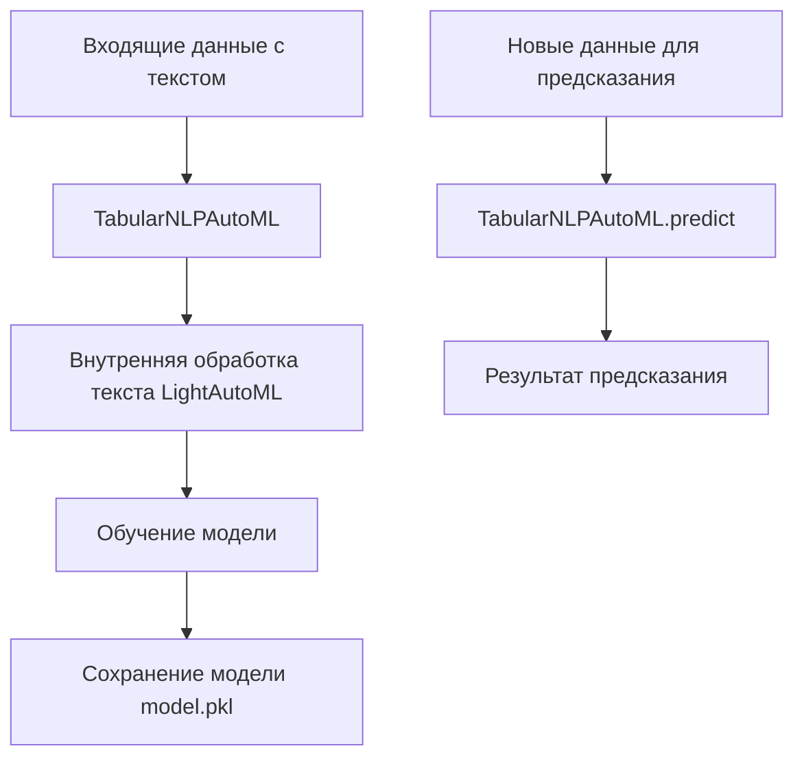
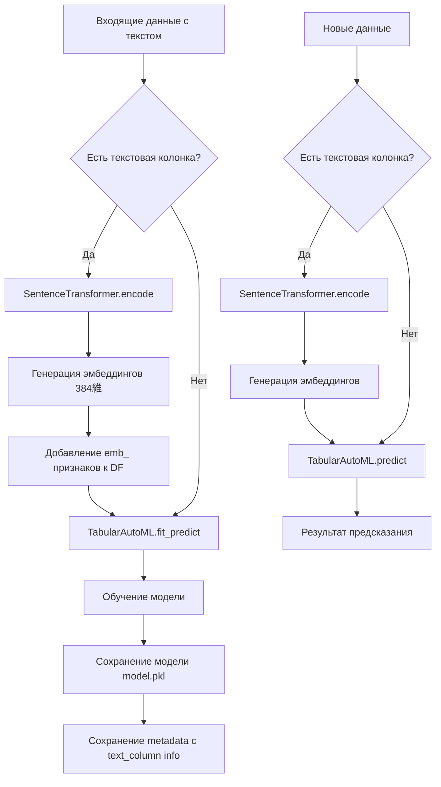

# План миграции от TabularNLPAutoML к SentenceTransformers + TabularAutoML

## Текущая архитектура

### Сейчас (до миграции)



**Ключевые места в коде:**

| Файл | Строка | Описание |
|------|--------|----------|
| [`main.py`](main.py:17) | 17 | Импорт `TabularNLPAutoML` |
| [`main.py`](main.py:187) | 187-197 | Создание `TabularNLPAutoML` для multiclass/binary |
| [`main.py`](main.py:166) | 166-167 | Установка роли `text` в `roles` |

---

## Новая архитектура

### После миграции



---

## Детальный план изменений

### 1. Анализ текущей архитектуры ✅

- Изучен код [`main.py`](main.py:1)
- Понимание использования `TabularNLPAutoML` для multiclass/binary задач
- `TabularAutoML` используется для регрессии

### 2. Дизайн новой архитектуры

#### Изменения в импортах

| Убрать | Добавить |
|--------|----------|
| `from lightautoml.automl.presets.text_presets import TabularNLPAutoML` | Уже есть: `from sentence_transformers import SentenceTransformer` |

#### Глобальная инициализация SentenceTransformer

Добавить глобальную переменную для кэширования модели:

```python
EMBEDDING_MODEL_NAME = 'sentence-transformers/all-MiniLM-L6-v2'
embedding_model = None

def get_embedding_model():
    global embedding_model
    if embedding_model is None:
        embedding_model = SentenceTransformer(EMBEDDING_MODEL_NAME)
    return embedding_model
```

#### Изменения в `/fit_predict/`

**Текущий код (строки 187-197):**
```python
automl = TabularNLPAutoML(
    task=task,
    timeout=MODEL_TIMEOUT,
    cpu_limit=os.cpu_count(),
    memory_limit=total_memory,
    reader_params={'n_jobs': os.cpu_count(), 'cv': 5, 'random_state': RANDOM_STATE},
    text_params={'lang': 'ru', 'bert_model': 'sentence-transformers/all-MiniLM-L6-v2', 'pooling': 'mean'},
    autonlp_params={'sent_scaler': 'l2', 'model_name': 'pooled_bert', 'transformer_params': {'bert_model': 'sentence-transformers/all-MiniLM-L6-v2', 'pooling': 'mean'}, 'cache_dir': './nlp_cache'},
    general_params={'nested_cv': False, 'use_algos': [['fttransformer']]},
    nn_params={'opt_params': {'lr': 1e-5}, 'max_length': 128, 'bs': 32, 'n_epochs': 7,},
)
```

**Новый код:**
```python
# Генерация эмбеддингов если есть текстовая колонка
text_column = item.df_text
if text_column is not None:
    texts = df[text_column].fillna('').tolist()
    embeddings = get_embedding_model().encode(texts, show_progress_bar=True)
    emb_df = pd.DataFrame(embeddings, columns=[f'emb_{i}' for i in range(384)])
    df = pd.concat([df.drop(columns=[text_column]), emb_df], axis=1)

task = Task(item.TaskType, metric=f1_macro)
automl = TabularAutoML(
    task=task,
    timeout=MODEL_TIMEOUT,
    cpu_limit=os.cpu_count(),
    memory_limit=total_memory,
    general_params={'nested_cv': False, 'use_algos': [['lgb', 'lgb_tuned']]}
)
```

#### Изменения в метаданных

Добавить в `metadata` информацию о текстовой колонке:

```python
metadata = {
    'columns': df.columns.tolist(),
    'dtypes': df.dtypes.to_dict(),
    'text_column': text_column  # Новая строка
}
```

#### Изменения в `/predict/`

Перед вызовом `automl.predict()` генерировать эмбеддинги:

```python
text_column = metadata.get('text_column')
if text_column is not None and text_column in new_df.columns:
    texts = new_df[text_column].fillna('').tolist()
    embeddings = get_embedding_model().encode(texts)
    emb_df = pd.DataFrame(embeddings, columns=[f'emb_{i}' for i in range(384)])
    new_df = pd.concat([new_df.drop(columns=[text_column]), emb_df], axis=1)

test_pred = automl.predict(new_df)
```

### 3. Модификация endpoint `/fit_predict/`

- Убрать создание `TabularNLPAutoML`
- Добавить логику генерации эмбеддингов
- Использовать `TabularAutoML` для всех типов задач (unify с регрессией)

### 4. Модификация endpoint `/predict/`

- Добавить логику генерации эмбеддингов перед предсказанием
- Проверить наличие `text_column` в метаданных

### 5. Обновление метаданных

- Добавить поле `text_column` в `metadata`
- Сохранять информацию о текстовой колонке при обучении

### 6. Обновление [`requirements.txt`](requirements.txt:1)

- Убрать зависимость `LightAutoML[nlp]==0.4.1`
- Заменить на `LightAutoML==0.4.1` (без NLP)
- Проверить, что `sentence-transformers` уже есть

### 7. Тестирование

- Проверить, что модель обучается без ошибок
- Проверить, что предсказания работают корректно
- Проверить сохранение и загрузку моделей

---

## Риски и замечания

| Риск | Митигация |
|------|-----------|
| Разница в результатах предсказания | Провести A/B тестирование на тестовой выборке |
| Увеличение времени обучения | Эмбеддинги генерируются быстрее, чем внутренняя обработка LightAutoML |
| Совместимость старых моделей | Старые модели, обученные с TabularNLPAutoML, не будут работать с новым кодом |
| class_mapping | Убрать логику с `automl.reader.class_mapping` так как TabularAutoML работает иначе |

---

## Дополнительные вопросы

1. **Какие алгоритмы использовать в TabularAutoML для multiclass/binary?** Сейчас используется `['fttransformer']`. Предлагаю `['lgb', 'lgb_tuned']` или `['linear_l2', 'lgb', 'cb']`.

2. **Нужна ли поддержка нескольких текстовых колонок?** Сейчас `df_text` - одна колонка.

3. **Нужна ли backward compatibility?** Старые модели не будут работать с новым кодом.
